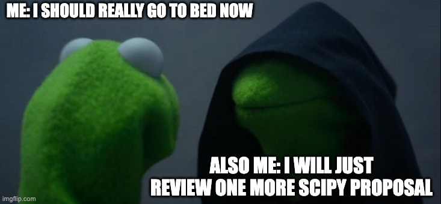
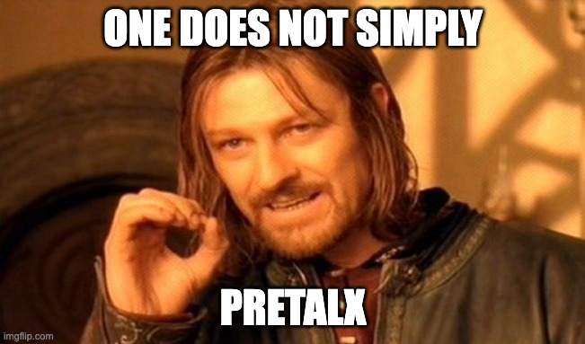
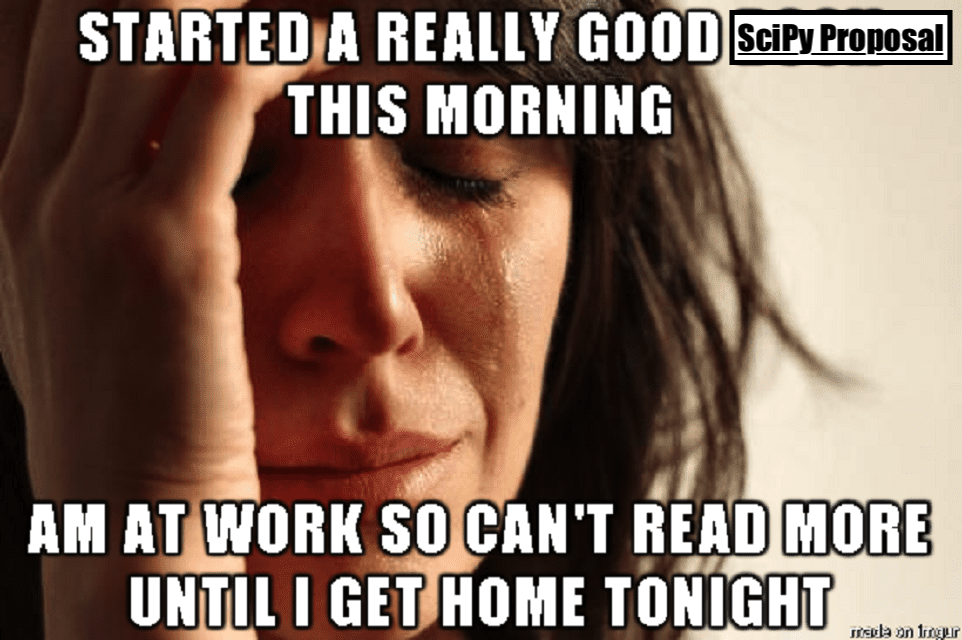
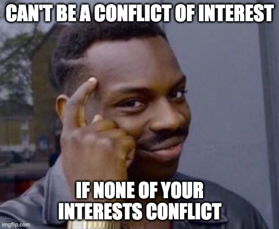

Proposal Reviewer Guidelines
============================

The Program Committee's job is to select the talks that maximize the benefit to the entire conference audience, within the space and time constraints given. Reviewers play an integral role in realizing this goal.

Each reviewer has approximately 5-9 proposals. The Program committee will share the exact deadline to submit reviews in Pretalx (typically end of March). Please submit reviews as soon as possible; it will allow us to finalize and announce the schedule sooner!

SciPy has adopted a double-open review process. Reviewers will see the name(s) of the submitters when they review a submission, and their name will be attached to their review. Their name will also be listed on the website as a member of the Program Committee.

Reviewers may be asked to review submissions for talks and tutorials. Tutorials should be approachable to a broad audience in the SciPy community, so all members of the reviewer pool are eligible to review them. Please refer to the tips for tutorial review for what we'd like to see in tutorial reviews. If you feel you are not qualified to review a tutorial that you are assigned, please contact the tutorials chairs.

Instructions
------------

Go to https://cfp.scipy.org/orga/event/2024/reviews/ to see your assigned proposals.
Each proposal will ask you to provide the following:

- **"Overall Evaluation"** (score +2 to -2)
-  **"Is the proposal interesting to a broad range of people in the SciPy community?"** (score +2 to -2)
- **answer questions** (+2 to -2) on the proposal clarity and completeness
- Finally, you will have an open response **"What did you think?"** question where we'd like you to detail your review of the submission and explain your ratings to the previous questions. 

Be on the lookout for unconscious bias when reviewing proposals, and make sure to mitigate them where you can. Take some time to educate yourself about bias in the review process, and equip yourself with the tools to interrupt this bias. For more details, see the `Bias in the review process`_ section below.

Please be clear and detailed in your review on why you'd like to see this proposal at the conference, or why you think it would not be a good fit; it will help track chairs in the selection process. For more details, see the `Tips for Reviewers`_ section below.

Please double check that the submissions assigned to you don't present a conflict-of-interest. If you do find that you have a conflict with one of the submissions you've been assigned, please notify the track chairs in the track to which that submission belongs and they will assign a different reviewer. For more details, read the `Conflict of interest`_ section below.

We expect all reviews to be conducted in accordance with the NumFOCUS Code of Conduct: https://numfocus.org/code-of-conduct. Please keep this in mind as you review submissions.

Bias in the review process
--------------------------

.. image:: bias.jpeg
  :width: 400
  :alt: your bias is showing. just a bit

Research shows that peer review can suffer from implicit bias—just like the hiring processes—that disadvantages women, minorities and people from less-prestigious institutions. There is also research attesting to higher quality in signed reviews compared to anonymous reviews [1],[2],[3]. For this reason, we want to educate our reviewers about bias in the review process, and equip them with tools to interrupt this bias.

Human beings are consistently, routinely, and profoundly biased. We not only are profoundly biased, but we also almost never know we are being biased. (Interested?[4],[5])

First, by realizing and accepting that we all have bias, we can learn to watch for it in ourselves and help others who work with us to do the same. This process of building awareness is analogous to what happens when we step on the clutch in a manual-transmission automobile. The motor doesn't stop running (bias doesn't stop), but the car is no longer moving forward. When we are on the lookout for our biases, they are less likely to blindly dictate our decisions.[6]

Be on the lookout! As you review, ask yourself …

- Are there things about the proposal that particularly influence my impression? Are they relevant to the talk?

- What assessments have I already made about the speaker? Are these grounded in solid information or are they simply my interpretations?

- Does this person's work remind me in any way about myself? Is my own agenda influencing my assessment of this proposal? Are there past experiences of mine that are influencing factors?

- Does this person remind me of anybody, positively or negatively? (Be careful to observe rater biases relating to current projects or work. It is easy to slip into evaluating proposals more or less positively because they happen to be on a project that is important to you.)

- Does this person's academic institution, place of employment, or any other affiliations affect how I perceive their work?

Things to think about as you prepare to review:

- Bias in pattern-recognition responses — Does one person benefit because they do things “the way we do it around here,” rather than because it is the most innovative, productive, and effective way?

- Pay attention to your projections about the work being evaluated.

- Look for patterns of assessment among different groups. For example, are women in general rated differently than men? 

- Look out for Semantic gender priming: exposure to words more strongly associated with male (e.g., aggressive, competitive) or female (e.g., supportive, nurturing) stereotypes affects subsequent evaluation of male or female targets.[7] 

- Inferences about an individual based on aggregate data or assumptions about a group: making assumptions about individuals based on cultural stereotypes is a type of ecological fallacy. For example, because fewer women lead large center grants, making the assumption that an individual woman is less able to lead a large program; or because overall Black student achievement is lower than for White students, making the assumption that an individual Black student is less prepared.[4]

- Interrupt your bias—refresh yourself after each section as to what rubric/metrics you've established and make sure that you're reviewing a submission accordingly. Be polite. Instead of telling, ask new ways of approach.

- Don't be rude. Always say at least one good thing.

- Be grateful. Point out what you learned and say thanks.

- Stay fresh while reading. Long time reviews might cause some spots to be left uncovered.

- Reviewers have multiple demands on their time, and are frequently under time-constraints to finish reviews, be aware that cognitive biases are efficient, time pressure promotes their influence on decision-making.[4]

Other interesting links on the topic about gender bias:

`Threats to objectivity in peer review: the case of gender <https://www.google.com/url?q=https://www.ncbi.nlm.nih.gov/pmc/articles/PMC4552397/&sa=D&ust=1490135409272000&usg=AFQjCNHHxEg8S2lRH-uZYvHLWvQquG3fdg>`_:

`A Linguistic Comparison of Letters of Recommendation for Male and Female Chemistry and Biochemistry Job Applicants <https://www.google.com/url?q=https://www.ncbi.nlm.nih.gov/pmc/articles/PMC2572075/&sa=D&ust=1490135409273000&usg=AFQjCNG7ODzPnsgxZEaDoxNdNSfjeVskAw>`_:

`Science faculty's subtle gender biases favor male students <https://www.google.com/url?q=http://www.pnas.org/content/109/41/16474.abstract&sa=D&ust=1490135409274000&usg=AFQjCNHeGWyMB7QNHg67j-Blecszk7H9Ig>`_:

`How stereotypes impair women's careers in science <https://www.google.com/url?q=http://www.pnas.org/content/111/12/4403.abstract0&sa=D&ust=1490135409275000&usg=AFQjCNGs6y8FQwel92fbeClDr8_iTHsxUw>`_:

Prepared by the SciPy 2017 Diversity Committee and Program Chairs. Thanks to Philip B. Stark for useful links.

This section is a compilation from different sources listed below:

- https://doughellmann.com/blog/2011/10/18/how-i-review-a-pycon-talk-proposal/

- https://nearsoft.com/blog/europython-2016-a-review/

- Everyday Bias: Identifying and Navigating Unconscious Judgments in Our Daily Lives. Howard J. Ross.

- https://hbr.org/2015/04/3-ways-to-make-less-biased-decisions

- https://www.ncbi.nlm.nih.gov/pmc/articles/PMC4238945/#!po=88.4615

[1] http://bmjopen.bmj.com/content/5/9/e008707

[2] http://bjp.rcpsych.org/content/176/1/47/full-text.pdf+html

[3] https://www.ncbi.nlm.nih.gov/pubmed/28580134/ 

[4] https://www.amazon.com/Everyday-Bias-Identifying-Navigating-Unconscious/dp/1442230835

[5] https://implicit.harvard.edu/implicit/takeatest.html

[6] https://hbr.org/2015/04/3-ways-to-make-less-biased-decisions

[7] Threats to objectivity in peer review: the case of gender

Tips for Reviewers
------------------

You should analyze the presentation in the aspects described below, thanks to `Doug Hellmann <https://doughellmann.com/blog/>`_ for these tips:

The Abstract: occasionally a title comes along that is so compelling that I have to remind myself to keep reading before voting +1 and moving on to the next talk. It isn't enough for a proposal to cover an interesting topic. It has to indicate that the talk will be interesting, too. While I am reading, I look for several factors.

- **Is the abstract clear?** The speaker should describe the topic they plan to talk about in terms I can understand, even if I don't know anything about that subject area. A clearly written abstract, without a lot of domain-specific jargon, tells me the speaker will be able to communicate with the audience.

- **Is the abstract complete?** An incomplete proposal is the largest negative factor I consider. If a proposal is incomplete, I can't really say what the speaker will talk about, or even if they know the subject matter for their talk. If a proposal does not have a detailed summary or outline, I as the submitter to provide more detail.

- **Is the abstract compelling?** Without regard to the actual subject, is the abstract written in a way to attract an audience? I look for an abstract that shows the speaker is excited about the topic, and that they will be conveying that same excitement to the audience.

The Topic: for some people, the subject matter of a talk is the most important, or only, aspect taken into consideration when voting. I have seen presentations on topics I thought would be boring, but which were delivered with such enthusiasm that I enjoyed them more than talks I thought would be interesting from the outset. In my mind, the topic is an important factor, but not necessarily the most important, to be considered.

- **How relevant, immediately useful and novel is the topic?** I look first at whether the topic is relevant to the conference attendees. Attendees will have a range of experience levels, interests, and backgrounds. Although we want a broad set of topics, we do need to be careful to avoid talks that are too narrowly focused on a niche. I often recommend that new projects which show a lot of promise convert their talk proposal into a poster proposal. As a counterpoint to considering whether a topic is too niche, I also try to take into account whether the audience will take away something immediately useful.

Conflict of interest
--------------------

The definition of a Conflict of Interest in peer review is a circumstance that makes you "unable to make an impartial scientific judgment or evaluation.” ([PNAS Conflict of Interest Policy](http://www.pnas.org/site/authors/coi.xhtml)). 
Conflict of Interest (COI) is different from individual bias. It is concerned with independence from any interest that could impair your objective assessment, any concern other than the intellectual quality of the work.

As a reviewer, your present or previous association with certain authors poses textbook COI: recent collaborators in research funding or publications (in the past 4 years), family members, business partners, and thesis student/advisor or mentor. Other associations could be more tenuous: being employed by the same institution, for example. In this case, your obligation as reviewer is to disclose the potential COI to the area chair or Program Chair, and state whether you think you are able to make an impartial assessment of the work.

If you have a conflict of interest with a submission, you should decline to review it and disclose the specific reason to the Program Chairs.

As Area Chair of a conference track or mini symposium, you should avoid conflicts of interest in making acceptance decisions: you should recuse yourself from decisions on the work of your collaborators (or indeed, your own submissions), and let that decision be handled by your co-chair (or Program Chairs).

Declaring the potential of a conflict of interest is required under professional ethics. If in doubt: ask the Program Chairs.
