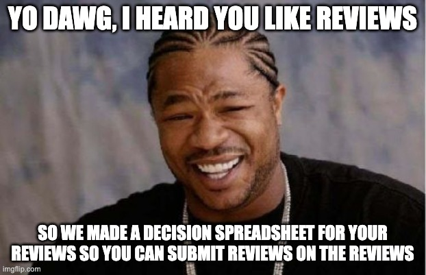
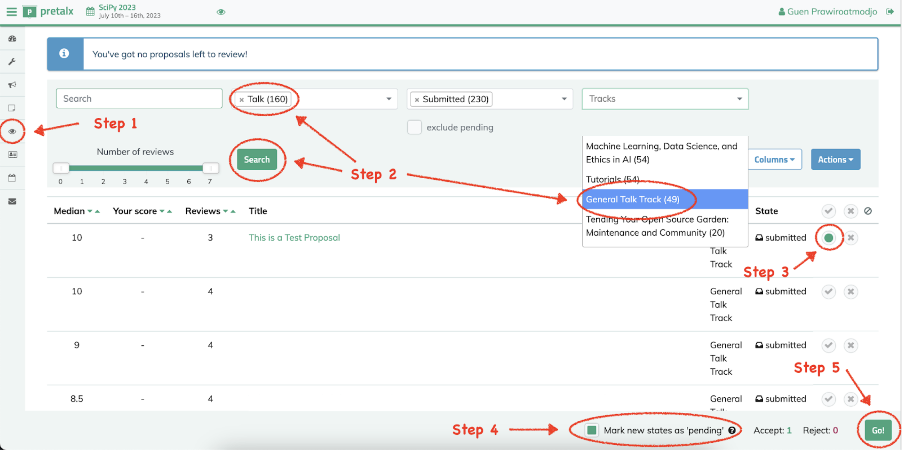
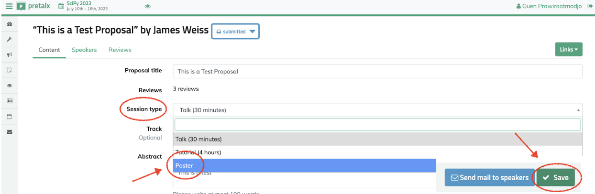

Track chair instructions
------------------------

Congratulations and huge thank you for being track chair at SciPy! This page includes some instructions on what to do in this role. Some of these may change from year to year, and you will receive the most up to date information from the Program committee around the key deadlines.

SciPy Track Chair responsibilities
==================================

The role of the track co-chairs is to help shape the program for SciPy 2024. This includes:

- encouraging submissions from your community

- help recruit reviewers for your track

- shepherd the collection of timely reviews once reviewers are assigned

- provide extra reviews, in case of need (cover for delinquent reviewers)

- make accept/reject recommendations of submissions

- curate the track by selecting proposals for podium and poster slots

- chair the session at the conference

Key deadlines for Program committee
===================================

These vary from year to year and will be shared with you via email.

Submissions and reviews
=======================

This year, the conference will be using Pretalx to manage the submissions and reviews. You can find all talks submitted for your track and their reviews in the "Submission status_<your track>" spreadsheet that we will share with you ahead of the track decision deadline. The spreadsheet includes some helpful tools to see the average scores for your track’s submissions, set the status and add comments. Feel free to edit the spreadsheet as needed. Once you have made your decisions, please submit your assignments via Pretalx using the instructions below.

Here are the steps to follow in Pretalx to make your selections:

1. Go to the “Reviews” tab.
2. Select “Talk” under “Session type”. Select your track under “Tracks” and click “Search”.
3. Click the “Accept” check mark on the row(s) for each proposal you’d like to accept as a Talk. Click “Reject” only if you believe the submission is incompatible with or does not meet the quality bar for the conference.
 - For submissions that were submitted as "Talk" type but you want to offer a Poster slot, please click on the proposal title, change the Session type to “Poster” and click “Save”.

4. **Important**: Make sure the “Mark new states as ‘pending’” checkbox is selected.
5. Click on “Go.”
6. Repeat the above steps 2-5 for all submissions, but with Session type “Poster”. All in-person poser presenters will be considered for a back-up talk if one of the speakers can't make it. All posters that don't make it to the in-person poster session will be offered a virtual poster slot.
